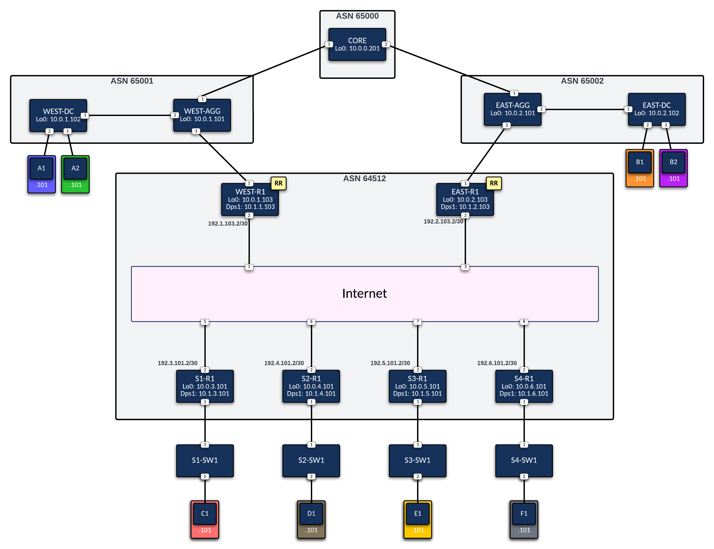

# autovpn-act-lab

An Arista AutoVPN lab built with [ACT](https://www.arista.com/assets/data/pdf/Datasheets/Cloud-Test-Datasheet.pdf) (Arista Cloud Test) and [AVD](https://avd.arista.com) (Arista Validated Designs).

## Overview

This lab simulates a WAN fabric using Arista's **AutoVPN** solution. Two hub routers (route servers) provide redundant AutoVPN control-plane services for four spoke sites, all connected over a simulated Internet underlay. Configurations are generated by AVD and deployed through CloudVision (CVaaS).

## Topology



| Node | Type | Role |
|------|------|------|
| WEST-R1, EAST-R1 | CloudEOS | WAN Route Servers (Hubs) |
| S1-R1 – S4-R1 | CloudEOS | Spoke routers |
| WEST-AGG/DC, EAST-AGG/DC, CORE | vEOS | Data center / aggregation |
| S1-SW1 – S4-SW1 | vEOS | Site access switches |
| HOST-A1 – HOST-F1 | Ubuntu 24.04 | Traffic generation / testing |
| CVP | CloudVision | Management & telemetry |
| INTERNET | vEOS | Simulated internet underlay |


## WAN Design

- **Mode**: AutoVPN
- **BGP AS**: 64512
- **Path group**: `internet` (single underlay)
- **IPSec**: Control-plane and data-plane encryption enabled
- **VRFs**: `default`, `A` (production)
- **AVT Policies**: `DEFAULT-AVT-POLICY`, `PROD-AVT-POLICY`

## Repository Structure

```
.
├── scripts/
│   └── sync-hosts.py           # Syncs management IPs from act/ into autovpn/ inventory
│
├── act/                        # ACT lab environment
│   ├── inventory.yml           # Ansible inventory (populated from ACT download)
│   ├── ansible.cfg
│   ├── group_vars/             # Connection vars per node type
│   ├── topology-files/         # ACT topology definition
│   ├── configs/                # Static infrastructure configs (VEOS devices)
│   └── playbooks/
│       ├── cvaas-onboarding.yml   # Onboard devices to CVaaS via TerminAttr
│       ├── push_configs.yml       # Push static configs to VEOS infrastructure devices
│       ├── push_license.yml       # Push CloudEOS IPSec license to flash and activate
│       └── configure_hosts.yml    # Configure Ubuntu tools servers (TOOLSSERVER group)
│
└── autovpn/                    # AVD WAN fabric
    ├── inventory.yml
    ├── group_vars/WAN/         # Fabric-wide settings (AutoVPN, path groups, VRFs)
    ├── group_vars/HUBS.yml
    ├── group_vars/SPOKES.yml
    ├── host_vars/              # Per-device overrides
    ├── intended/
    │   ├── configs/            # Generated EOS configs (.cfg)
    │   └── structured_configs/ # AVD structured data (.yml)
    ├── documentation/          # Auto-generated device docs
    └── playbooks/
        ├── build.yml           # Run AVD eos_designs + eos_cli_config_gen
        └── cv-deploy.yml       # Deploy configs to CloudVision
```

## Requirements

- ACT account with access to CloudEOS and vEOS images
- CVaaS (CloudVision as a Service) tenant
- [AVD devcontainer](https://avd.arista.com/stable/docs/containers/overview.html) for running AVD playbooks

## Workflow

### 1. Spin up the lab in ACT

Import `act/topology-files/bm-wan-autovpn-lab.yml` into ACT and start the topology.

### 2. Download the ACT inventory

Once the lab is running, download the Ansible inventory file from ACT (it contains the management IP addresses assigned to each node) and save it to `act/inventory.yml`.

### 3. Sync management IPs to the AVD inventory

Run the sync script from the repo root to propagate IP addresses from `act/inventory.yml` into `autovpn/inventory.yml`:

```bash
python3 scripts/sync-hosts.py
```

### 4. Onboard devices to CVaaS

```bash
cd act
ansible-playbook playbooks/cvaas-onboarding.yml
```

Requires a CVaaS service account token at `../cvaas-service.tok`.

### 5. Push infrastructure configurations

```bash
ansible-playbook playbooks/push_configs.yml
```

Pushes static configurations (interfaces, routing, AAA) to the VEOS infrastructure devices: CORE, INTERNET, AGG, DC, and site access switches.

### 6. Configure tools servers

```bash
ansible-playbook playbooks/configure_hosts.yml
```

### 7. Push the CloudEOS IPSec license

*Requires the license file at `../license_CloudEOS_IPSec.json`.*
```bash
ansible-playbook playbooks/push_license.yml
```

### 8. Build configurations with AVD

Run inside the AVD devcontainer:

```bash
cd ../autovpn
ansible-playbook playbooks/build.yml
```

Generates structured configs and EOS CLI configs under `autovpn/intended/`.

### 9. Submit configurations to CloudVision

```bash
ansible-playbook playbooks/cv-deploy.yml
```
A change control is now created in CVaaS.

### 10. Review and execute the change control in CVaaS

Log in to CVaaS and navigate to **Provisioning > Change Control**. Review the proposed configuration changes, then approve and execute the change control to deploy configs to the devices.

## Topology Validation Commands and Troubleshooting

